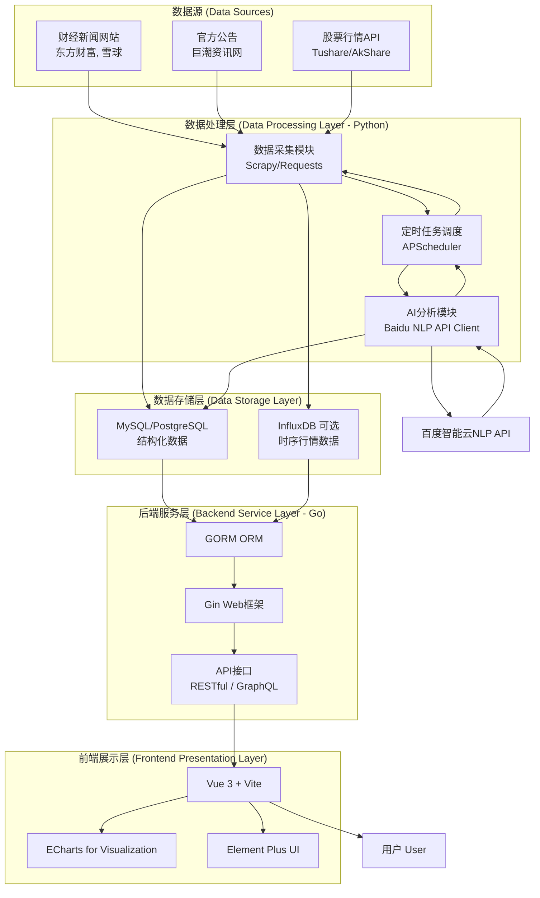

**聚焦A股科技股，利用AI API进行深度情绪与事件分析**——完整、可落地、且亮点突出的技术方案。

---

### **项目名称：** “**Tech-Pulse**” - AI驱动的A股科技股情绪与事件分析系统

### **项目愿景 (Elevator Pitch):**
> 本系统旨在实时捕捉和量化影响中国A股高科技公司的非结构化信息流，通过AI驱动的情绪分析和事件抽取技术，将繁杂的新闻、公告转化为直观的可视化洞察，为理解科技股的价值波动提供一个全新的数据决策维度。

---

### **一、 系统架构图**

这是一个经典且实用的分层架构，清晰地展示了数据流和技术模块。

---

### **二、 核心技术栈 (Tech Stack)**

*   **数据处理 (Python):**
    *   **数据采集:** `requests` + `BeautifulSoup` (轻量爬取), `scrapy` (复杂爬取)
    *   **行情获取:** `akshare` 或 `tushare`
    *   **任务调度:** `apscheduler` (定时执行采集和分析任务)
    *   **API调用:** `requests`
*   **后端服务 (Go):**
    *   **Web框架:** `Gin`
    *   **ORM:** `GORM`
    *   **数据库驱动:** `mysql-go` / `pgx`
*   **数据库:**
    *   **主数据库:** **MySQL 8.0** (支持JSON字段，方便存储半结构化数据)
    *   **时序数据库 (可选增强):** **InfluxDB**
*   **前端:**
    *   **框架:** **Vue 3** (使用Composition API) + **Vite** (极速构建)
    *   **UI库:** **Element Plus**
    *   **图表:** **Apache ECharts**
*   **AI服务:**
    *   **百度智能云NLP API:** 核心依赖，用于`情感倾向分析`, `事件抽取`, `文章摘要`。
*   **部署:**
    *   **容器化:** **Docker** & **Docker Compose**
    *   **Web服务器/反向代理:** **Nginx**

---

### **三、 数据库表结构设计 (MySQL)**

这是项目的骨架，设计好能事半功倍。

1.  **`stocks` - 股票信息表**
    *   `id` (PK)
    *   `ticker` (VARCHAR, 股票代码, e.g., '688256.SH', UNIQUE)
    *   `name` (VARCHAR, 股票名称, e.g., '寒武纪')
    *   `industry` (VARCHAR, 行业, e.g., '半导体')
    *   `is_representative` (BOOLEAN, 是否为代表性研究股票)

2.  **`market_data_daily` - 日行情数据表**
    *   `id` (PK)
    *   `stock_ticker` (FK -> stocks.ticker)
    *   `date` (DATE)
    *   `open`, `close`, `high`, `low` (DECIMAL)
    *   `volume` (BIGINT)
    *   UNIQUE KEY `(stock_ticker, date)`

3.  **`news` - 原始新闻表**
    *   `id` (PK)
    *   `url` (VARCHAR, UNIQUE, 防止重复抓取)
    *   `title` (TEXT)
    *   `content` (MEDIUMTEXT)
    *   `publish_time` (DATETIME)
    *   `source` (VARCHAR)
    *   `status` (ENUM('crawled', 'processed', 'failed'), 任务状态)

4.  **`stock_news_relation` - 股票新闻关联表 (多对多)**
    *   `stock_ticker` (FK -> stocks.ticker)
    *   `news_id` (FK -> news.id)
    *   PRIMARY KEY `(stock_ticker, news_id)`

5.  **`sentiments` - 情绪分析结果表**
    *   `id` (PK)
    *   `news_id` (FK -> news.id, UNIQUE)
    *   `sentiment` (ENUM('positive', 'negative', 'neutral'))
    *   `confidence` (FLOAT, 置信度)
    *   `processed_time` (DATETIME)

6.  **`events` - 事件抽取结果表**
    *   `id` (PK)
    *   `news_id` (FK -> news.id)
    *   `stock_ticker` (FK -> stocks.ticker)
    *   `event_type` (VARCHAR, e.g., '产品发布', '战略合作')
    *   `trigger_word` (VARCHAR, 触发词)
    *   `description` (TEXT, 事件描述)
    *   `event_time` (DATETIME, 事件发生时间，从新闻中解析)
    *   `details` (JSON, 存储事件主体、客体等结构化信息)

---

### **四、 核心模块实现要点**

#### **1. Python数据处理层**

*   **定时任务 (`main_scheduler.py`):**
    *   每小时执行`crawl_news()`任务。
    *   每5分钟执行`analyze_news()`任务。
    *   每个交易日下午4点执行`fetch_market_data()`任务。
*   **新闻爬虫 (`crawler.py`):**
    *   针对目标网站编写爬虫逻辑，抓取标题、正文、发布时间。
    *   进行简单的HTML清洗。
    *   对每条新闻，识别出其中提及的代表性股票，建立`stock_news_relation`。
*   **AI分析器 (`analyzer.py`):**
    *   从`news`表查询`status='crawled'`的新闻。
    *   封装调用百度API的函数，做好错误处理和重试机制。
    *   将返回的情绪和事件结果，标准化后存入`sentiments`和`events`表。
    *   更新`news`表的`status`为`processed`。

#### **2. Go后端服务层**

*   **分层结构:**
    *   `main.go`: 程序入口，初始化路由。
    *   `/api`: 定义API路由。
    *   `/controller`: 处理HTTP请求，参数校验，调用Service。
    *   `/service`: 核心业务逻辑，如计算情绪指数、聚合事件数据。
    *   `/dao` (or `/repository`): 数据访问层，封装GORM操作。
    *   `/model`: 定义数据库模型。
*   **核心业务逻辑 (Service):**
    *   **计算情绪指数:** 这是亮点！设计一个聚合算法。例如，可以按天聚合某股票的情绪得分：
      `daily_sentiment_score = SUM( (positive_news * confidence) - (negative_news * confidence) ) / total_news_count`
      可以进一步引入新闻来源、阅读量等作为权重。
    *   **数据聚合API:** 提供给前端的API需要做大量的数据聚合，而不是直接返回原始数据。例如，K线图API需要同时返回行情数据、每日情绪指数和当日发生的事件标记。

#### **3. 前端展示层**

*   **组件化开发:**
    *   `StockSearch.vue`: 股票搜索组件。
    *   `StockChart.vue`: 核心图表组件，内部封装ECharts的初始化和数据更新逻辑。这是最复杂的部分。
    *   `NewsList.vue`: 新闻列表组件，根据情绪显示不同颜色的标签。
    *   `EventTimeline.vue`: 事件时间轴组件。
*   **ECharts高级技巧:**
    *   **双Y轴:** 左Y轴为股价，右Y轴为情绪指数。
    *   **Tooltip联动:** 鼠标在图表上移动时，Tooltip能同时显示股价、成交量、情绪指数、当日事件。
    *   **`markPoint` / `markLine`:** 在图表上精准地标记出事件发生的日期，点击标记可以弹出事件详情。
    *   **`dataZoom`:** 提供时间范围选择和缩放功能。

### **五、 里程碑 (Milestones)**

*   **Week 1:** 完成数据采集和AI分析的Python脚本，能自动抓取新闻、调用API分析，并将结果存入设计好的数据库中。**(后端基础奠定)**
*   **Week 2:** 完成Go后端所有核心API的开发和测试，能为前端提供稳定、聚合好的数据。**(数据通道打通)**
*   **Week 3:** 完成前端核心可视化Dashboard的开发，特别是ECharts图表的实现，能展示K线-情绪叠加图和事件标注。**(核心价值呈现)**
*   **Week 4:** 前后端联调、Bug修复、Docker化部署到云服务器，并撰写项目文档和总结。**(项目闭环与沉淀)**

这个方案为你提供了一张清晰的作战地图。按照这个蓝图，你将能在一个月内，有条不紊地构建出一个技术先进、功能完整、令人印象深刻的毕业设计/求职/申请项目。
